+++
title = "Ngày 01 - 15/06/2026"
weight = 1
+++

## Topics Learned

### Git

#### Các câu lệnh phổ biến

| Lệnh               | Mô Tả                                            |
| ------------------ | ------------------------------------------------ |
| git init           | Khởi tạo kho lưu trữ Git mới                     |
| git remote         | Quản lý kết nối kho lưu trữ từ xa                |
| git clone          | Sao chép kho lưu trữ từ xa về máy cục bộ         |
| git fetch          | Tải các thay đổi từ xa mà không hợp nhất         |
| git pull           | Tải và hợp nhất các thay đổi từ xa               |
| git status         | Hiển thị trạng thái hiện tại của kho lưu trữ     |
| git branch         | Liệt kê, tạo hoặc xóa các nhánh                  |
| git switch         | Chuyển sang nhánh khác                           |
| git checkout       | Chuyển nhánh hoặc khôi phục tệp thư mục làm việc |
| git add            | Chuẩn bị các thay đổi để commit                  |
| git commit         | Ghi lại các thay đổi vào kho lưu trữ             |
| git commit --amend | Sửa đổi commit cuối cùng                         |
| git push           | Tải các commit cục bộ lên từ xa                  |
| git reset          | Bỏ chuẩn bị hoặc đặt lại các commit              |
| git rebase         | Áp dụng lại các commit trên một nhánh khác       |
| git rebase -i      | Rebase tương tác để chỉnh sửa các commit         |
| git stash          | Lưu các thay đổi chưa commit tạm thời            |
| git stash pop      | Khôi phục các thay đổi đã lưu trữ                |
| git merge          | Kết hợp các thay đổi từ nhánh khác               |
| git cherry-pick    | Áp dụng các commit cụ thể từ nhánh khác          |

#### Xử Lý Xung Đột Git

| Tình Huống                                | Giải Pháp (Source Control)                                                                         |
| ----------------------------------------- | -------------------------------------------------------------------------------------------------- |
| Giữ lại thay đổi từ cả hai nhánh          | Mở tệp trong trình soạn thảo, chỉnh sửa thủ công để bao gồm cả hai thay đổi, rồi nhập vào dấu ✓    |
| Giữ lại thay đổi từ nhánh hiện tại        | Di chuột qua dấu xung đột và nhập nút "Accept Current Change"                                      |
| Giữ lại thay đổi từ nhánh đến             | Di chuột qua dấu xung đột và nhập nút "Accept Incoming Change"                                     |
| Hủy hợp nhất và bắt đầu lại               | Nhập biểu tượng Source Control ở thanh bên, rồi nhập menu "..." và chọn "Abort Merge"              |
| Giải quyết xung đột trong trình soạn thảo | Xung đột được đánh dấu bằng màu sắc, chỉnh sửa thủ công hoặc sử dụng giao diện giải quyết xung đột |

---

### Demo github
# I.Thực hành git cơ bản, tạo nhánh → commit → tạo Pull Request → merge, và xử lý xung đột đơn giản.

1. Khởi tạo 1 repo mới có tên là git-practice
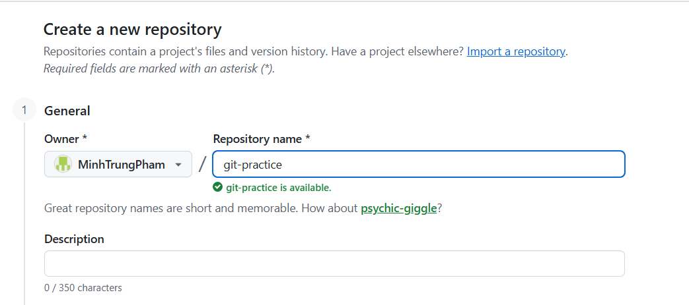
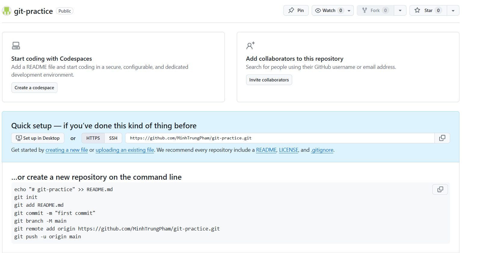
2. Thực hiện clone Repo trống về máy 
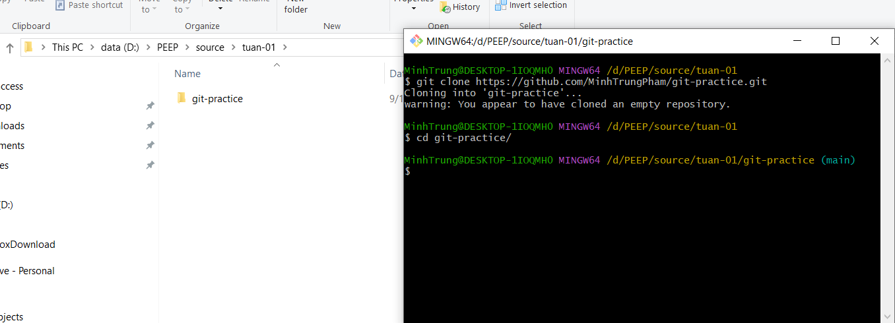
3. Tạo file README.md trên main, thực hiện commit, push lên main
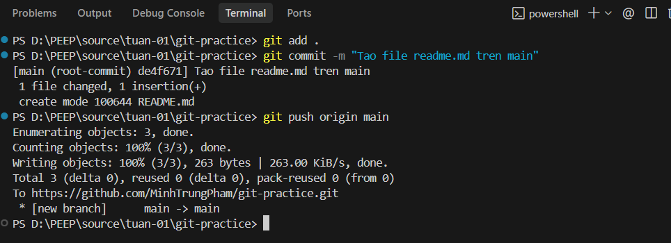
4. Tạo 2  nhánh mới từ main, thực hiện chỉnh sửa file README.md, commit, push, tạo pull request.
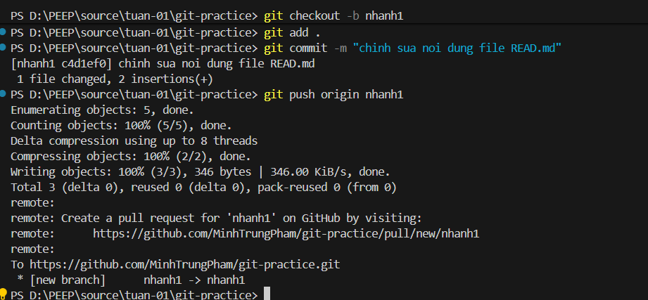
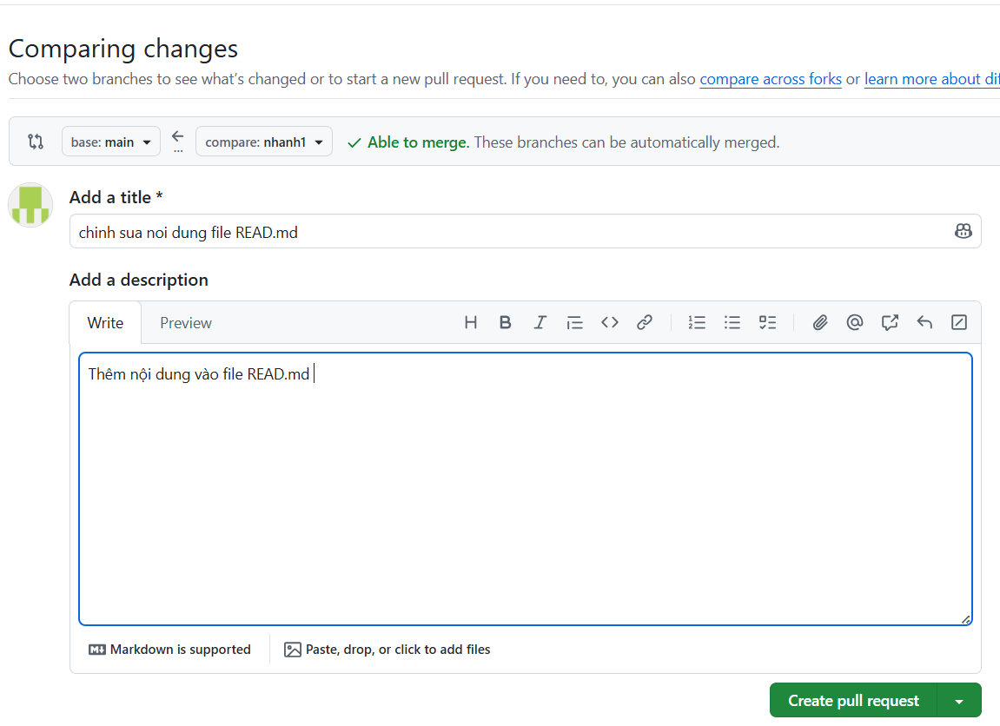
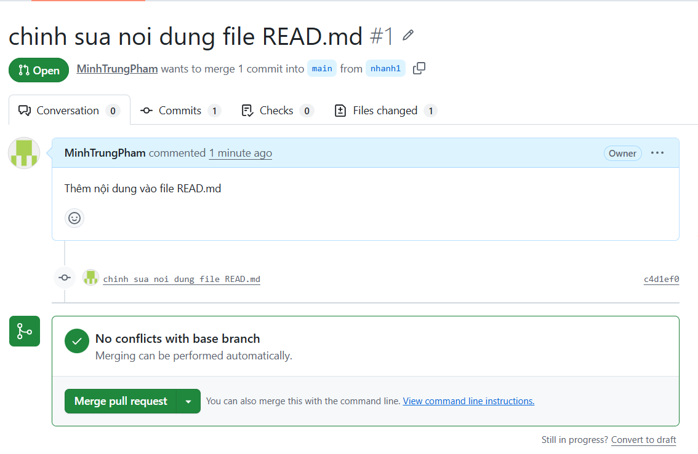
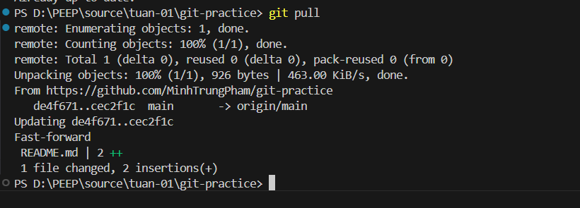
5. Tạo và giải quyết conflict
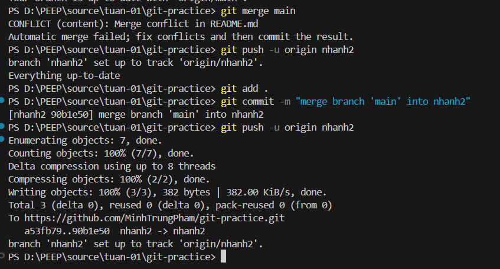
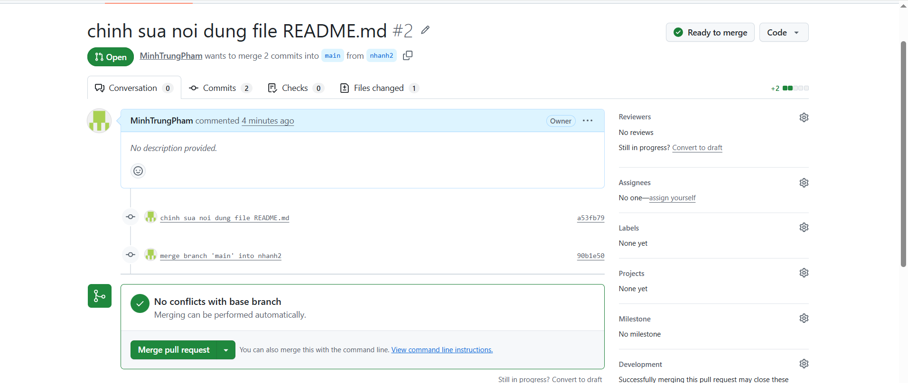
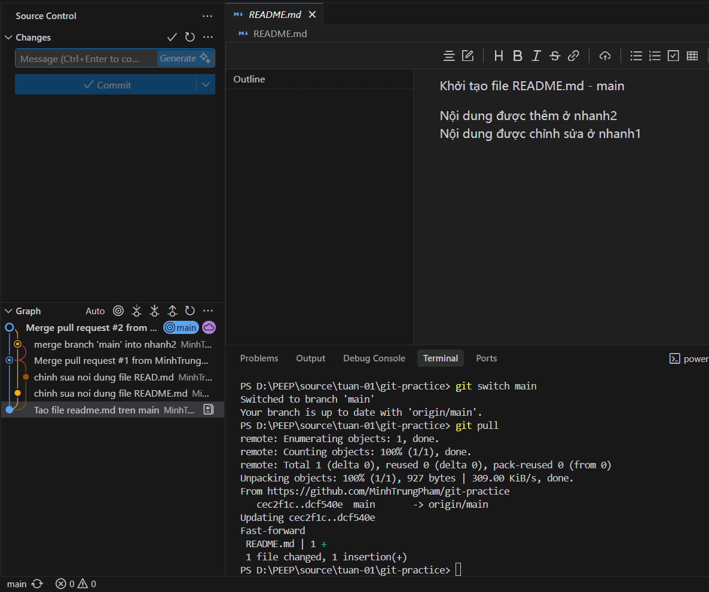